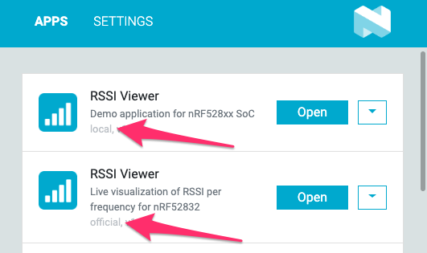

---
---

# Installing local apps

When you start a freshly installed nRF Connect for Desktop, it shows a list of all apps officially supported by Nordic Semiconductors. But if developers create new apps or new versions, they can also [create a developer bundle of an app](./app_development#distribute-development-versions) consisting of a file like `pc-nrfconnect-boilerplate-0.0.1.tgz` which users then can install manually:

1. Copy the file to `%USERPROFILE%\.nrfconnect-apps\local` (Windows) or `$HOME/.nrfconnect-apps/local` (Linux/macOS).
2. Restart nRF Connect for Desktop. The app should now appear in the apps list.

      Please note: If the app has the same name as an official app, it now appears twice in the list. You can differentiate the two by the label below it: One says "official", while the other one is "local":

      
